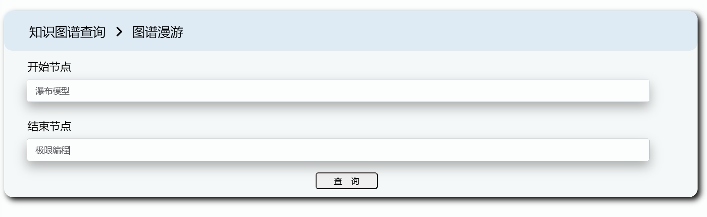

#### 介绍
多人协同的知识库图谱

#### 软件架构
使用了Django框架，利用neo4> 这里输入引用文本j数据库实现知识图谱管理

#### 安装教程

1.  配置好Pycharm和虚拟环境
2.  将本项目clone到本地
3.  根据requeriment.txt配置项目所需的库

#### 使用说明
1.用户在Cognilink软件中，可以进行游客登录，游客登录时，只能对知识图谱进行查看和漫游操作。

 
以下展示的为知识图谱主页面。

 
当我们以游客身份登陆时，操作受限显示。

 
2.用户登入Cognilink软件，进行账号注册和登录

 
3.点击home的加号即跳转新建图谱页面，对新图谱进行命名、添加初始节点等对应操作。

 
在对应区域输入图谱各项信息。

 
当建立完成后，点击保存即可在图谱漫游中图谱展示区域看到相应图谱。

 
4.双击对应图谱可以对图谱进行删除，删除后在搜索框内搜索对应图谱，网页会提示“请先新建图谱”。】

 
5.返回首页即可看到目前的学科图谱封面，封面随机生成。

 
6.点击某一学科的图谱即可看到该学科的所有知识图谱，并且可以进行编辑修改增加和删除。

 
可在下拉框中选择对应功能。

 
以编辑节点详情为例，展示如下。首先选择节点名称和类型。

 
然后在对应编辑区域输入新的内容。

 
7.在图谱漫游界面，输入起始节点、终止节点之后，可视化界面自主更新，显示从起始节点到终止节点的所有通路。

 
效果如下：

 
8.用户创建账号后，拥有对应的用户界面，用户可以在用户界面中修改用户头像、用户姓名，完成修改账号密码等操作。

 
9.Cognilink支持多人协同构建、编辑知识图谱。
10.请尽情探索吧！

#### 参与贡献

1.  Fork 本仓库
2.  新建 Feat_xxx 分支
3.  提交代码
4.  新建 Pull Request
